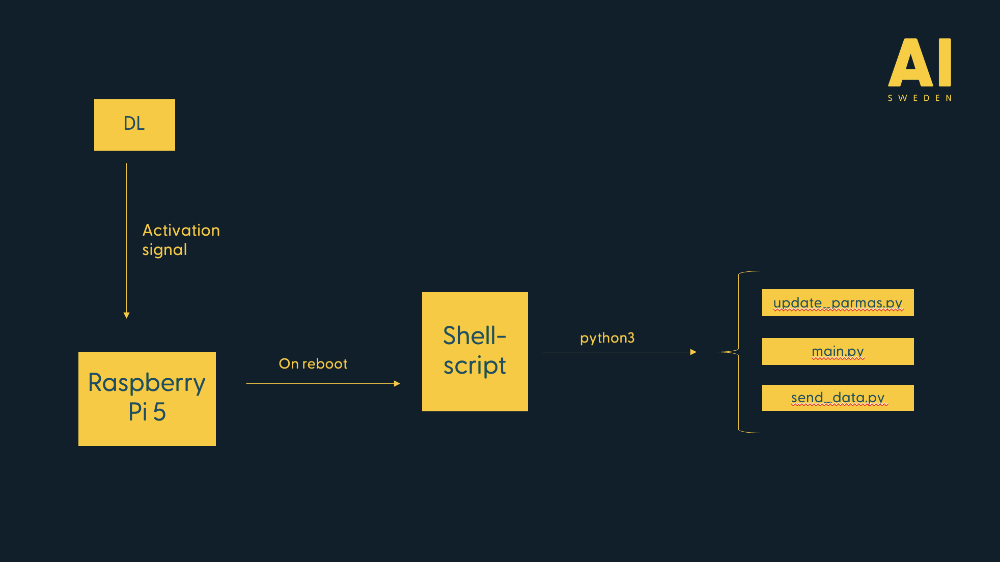

# Echoedge
Repo with code and instructions on how to run echodata processing and analysis on the edge. 


## Usage and installation instructions
These instructions are based on Raspberry Pi 5 (4GB RAM) as edge device. It is possible that the setup and the installation process could differ when using other edge devices. 

### Code and environment
Start by checking your current environment, our configuratios are shown below. It should be possible to run with other python-versions and other operating systems. Please note that the latest version of `Echopype` is only compatible with `Python>=3.9`.

##### Check python-version
```Shell
$ python3 --version
Python 3.11.2
```

##### Check pip-version
```Shell
$ pip3 --version
pip 23.0.1 from /usr/lib/python3/dist-packages/pip (python 3.11)
```

##### Check distro and version
```Shell
$ lsb_release -a
No LSB modules are available.
Distributor ID:	Raspbian
Description:	Raspbian GNU/Linux 12 (bookworm)
Release:	12
Codename:	bookworm
```

##### Clone this git repo and create a virtual environment in Python
```Shell
git clone https://github.com/aidotsejoakim/echoedge
cd echoedge
python3 -m venv venv
source venv/bin/activate
```

##### Install necessary packages
```Shell
sudo apt-get install libhdf5-serial-dev netcdf-bin libnetcdf-dev
sudo apt-get install libatlas-base-dev
sudo apt-get install libopenblas-dev
pip3 install -r requirements.txt
```


##### A cron job has to be configured since the scripts should be running automatically every time the device boots
```Shell
sudo apt-get update
sudo apt-get upgrade
sudo apt-get install postfix
sudo apt-get install cron
systemctl status cron # verify that cron is running
crontab -e # edit the crontab file
```

##### Add the following row to the crontab file to run the shell-script on reboot of your device
```Shell
@reboot sh /PATH/TO/REPO/echoedge/reboot.sh
```


### Workflow


### Create txt-file from a dir with files

```Python
import os 

for file in os.listdir('/home/joakim/Dokument/sailor_data'):
    with open('completed_files.txt', 'a') as txt_doc:
        txt_doc.write(f'{file}\n')
```

### Help
##### To find path to mounted USB-device
```Shell
lsblk
```

## Hardware

### Edge devices
Since energy consumption, boot time and processing speed are the three of the major parameters when running onboard, we decided to go for the Raspberry Pi 5 with 4GB RAM. Before making the final decision, we went through a quite extensive testing process to find the most efficient edge device in our usecase.

| **Model**  | **RAM (GB)** | **Estimated power consumption (W)** | **Processing time (seconds, 100 MB .raw-file)** |
|---------------|---------|---------|---------|
| Rasoberry Pi 5, Raspbian 12 (bullseye) OS | 4 | 4-5 | 12 | 0.655 | 0.828 |
| Coral Dev Board | 4 | 2-3 | N/A |
| Raspberry Pi 4, Raspbian 11 (bullseye) OS | 8 | 3-5 | 27 |
| Nvidia AGX Xavier, JetPack 5.1 R35.3.1 | 32 | 10-30 | 8 |
| VM (8 cores), Ubuntu 22.04.3 LTS| 32 | N/A | 5 |

### Echosounder 
We are using [Kongsberg-Simrad](https://www.kongsberg.com/maritime/contact/simrad/)'s EK80 echosounder. Read more about supported echosounders, the supported raw file types and how to convert the raw-files in the [Echopype documentation](https://echopype.readthedocs.io/en/stable/convert.html#conversion-operation). If you are using another echosunder than [Kongsberg-Simrad](https://www.kongsberg.com/maritime/contact/simrad/)'s EK80 echosounder, you will have to update the `sonar_model` in `functions.py`.

```Python
raw_echodata = ep.open_raw(path, sonar_model="EK80")
```

## Ackownledgements
* The processing of the raw-files from the echosounder are based on the [Echopype](https://echopype.readthedocs.io/en/stable/) library. 
